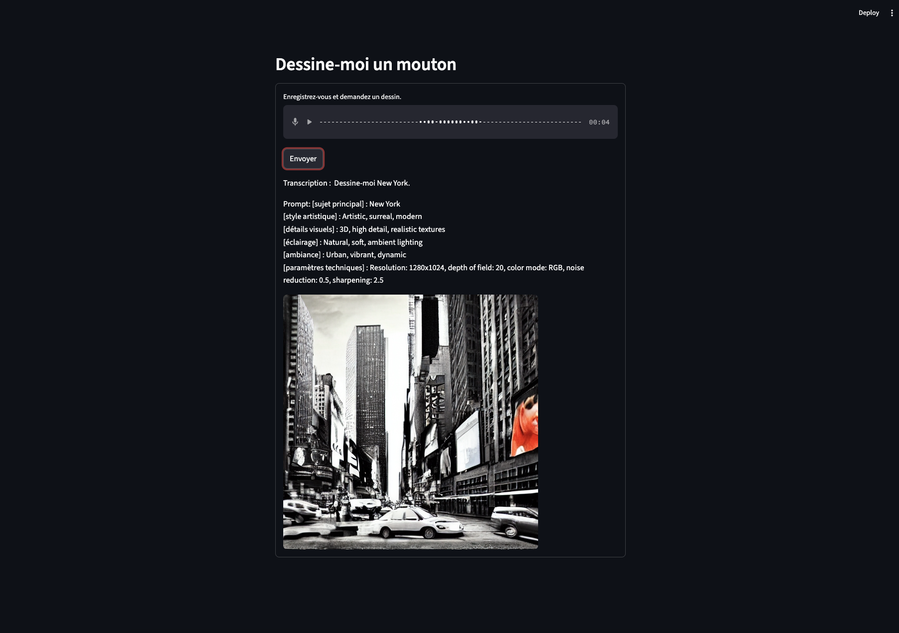

# Dessine-moi un mouton !

Génération d'images à partir de la parole



## Installer le projet et ses dépendances

```bash
git clone https://github.com/Grouloo/module0-brief2.git

pip install -r requirements.txt
```

## Démarrer

### Lancer le frontend Streamlit

```bash
streamlit run main.py
```

Un nouvel onglet devrait s'ouvrir.

Si ce n'est pas le cas, l'application devrait tout de même être accessible depuis l'adresse http://localhost:8501/

## Technique

### Modèles utilisés

Ce projet utilise trois modèles d'IA différents afin de proposer un workflow _speech-to-text-to-prompt-to-image_.

Voici ces modèles, choisis pour leur capacité à être exécutés en local sur une machine personnelle et pour la qualité de leurs réponses :

1. **Speech-to-text :** [Whisper-Small d'OpenAI](https://huggingface.co/openai/whisper-small) (configuré pour la langue française)
2. **Text generation :** [Qwen3-0.6B d'Alibaba Cloud](https://huggingface.co/Qwen/Qwen3-0.6B) (configuré pour passer l'étape de réflexion)
3. **Text-to-image :** [Stable Diffusion v1-5 de Stability AI](https://huggingface.co/stable-diffusion-v1-5/stable-diffusion-v1-5) (le dépôt originel de Stability AI ayant été supprimé, le dépôt utilisé ici est un clone)

### Défi technique : choix du modèle de langage

Plusieurs difficultés ont été rencontrées lors de la réalisation du segment de l'application permettant de transformer la transcription du message de l'utilisateur en véritable prompt pour un modèle de génération d'image.

Il fallait dans un premier temps choisir un modèle ni trop gros (pour qu'il puisse tourner en local sur une machine personnelle) ni trop petit (au risque de se retrouver avec une réponse sans queue ni tête, comme avec GPT-2 par exemple)

Le modèle utilisé ici est finalement `Qwen3-0.6B`, avec son étape de réflexion désactivée afin de raccourcir le temps de traitement (le contenu produit durant l'étape de réflexion lors de cette tâche n'était de toute façon pas très pertinent : le modèle tournait en rond et ne parvenait pas à aboutir à quelque chose de concret).

La deuxième étape fut de trouver le bon prompt : en effet, le modèle étant relativement petit, il faut pouvoir lui communiquer des instructions compréhensibles, structurées, et courtes.

Plusieurs prompts ont été essayé, mais dans la plupart des cas le modèle n'arrivait simplement pas à donner une réponse avec la structure attendue ou bien était hors-sujet, quand il n'était pas carrément en train de simplement répéter la description textuelle donnée.

Le prompt utilisé actuellement est celui-ci : "Transforme cette description en prompt Midjourney optimisée. Format de sortie : [sujet principal], [style artistique], [détails visuels], [éclairage], [ambiance], [paramètres techniques]\n Description : {transcription du message audio}".

Il semble fonctionner correctement dans la plupart des cas, mais nul doute qu'il pourrait encore être amélioré.
